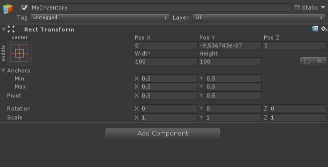
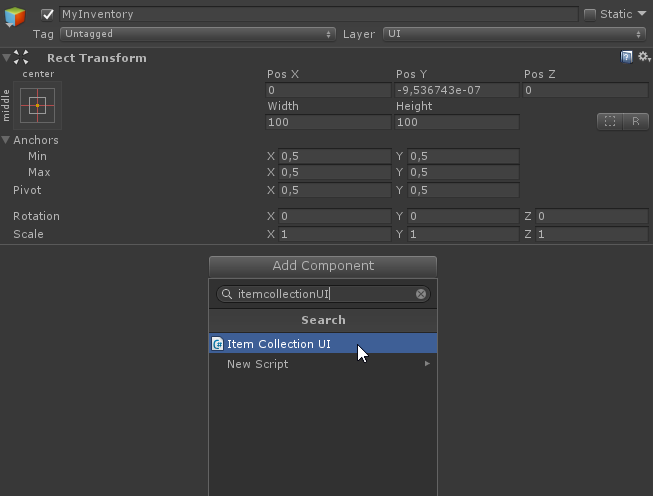
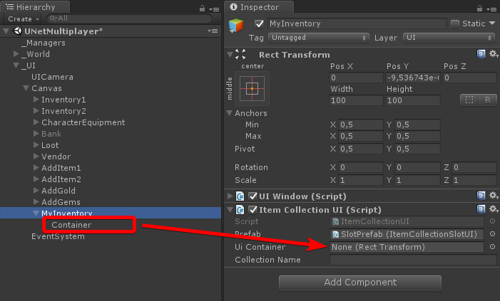

# Collection UI

Using the `ItemCollectionUI` a UI (uGUI) can be defined for a collection.


## Fields

- Prefab: The UI prefab used to display a single item.
- UI Container: The container in which the slots will be stored.
- Collection Name: The name of the collection that we intend to display here.

## Collection Creator

The collection creator component can create a new collection. 

!!! notice
	The collection name set in the `ItemCollectionUI` component has to match the name set in the `ItemCollectionCreator` component.


## Walk through

1. Create a new empty object inside your canvas and name it "MyInventory".



2. Attach the `ItemCollectionUI` component. Or see [CollectionSlotUI](CollectionSlotUI.md) on how to implement your own.



3. Set UI Prefab. This should be a prefab that has the `ItemCollectionSlotUI` component, or a component inheriting from `CollectionSlotUIBase<IItemInstance>`.


4. Create a new empty object inside object created at step 1 (MyInventory) and name it "Container". Drag this object into the "UI Container" field.



5. Set the collection name. This has to match the name in your collection creator.

6. A UIWindow component was added when we added the `ItemCollectionUI` component on step 1. We can add a `UIWindowInputHandler` component to show / hide the window when a key is pressed.


## CollectionUIBase<T>

The `CollectionUIBase<T>` class is a useful helper class that you can use to implement a custom collection UI. You're not required to use this base class.

## Slots

Slots represent a single item and all of it's information in the collection. See [Slot UI](CollectionSlotUI.md) for more details.

## Custom collection UI

### UIQueuedMonoBehaviour<T>

The `UIQueuedMonoBehaviour<T>` is a base class that queue's up changes and repaints everything at once when the UI becomes visible. If the UI is already visible at the time of the change a repaint will occur instantly.

Elements that are affected multiple times will only be queued once, and thus, will only repaint once.

```csharp
public sealed class ItemCollectionUI : CollectionUIBase<IItemInstance>
{
	protected override CollectionSlotUIBase CreateUIElement(int index)
	{
		var inst = (CollectionSlotUIBase<IItemInstance>)base.CreateUIElement(index);
		
		// Do something to newly created UI slot instance.

		return inst;
	}

	protected override void Repaint(int slot)
	{
		base.Repaint(slot);

		// Do something else.
		// Note that you can also handle the repaint in a custom slot class.
	}
}
```