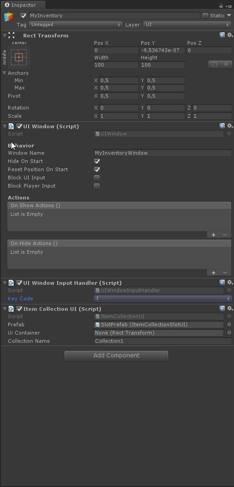

# Collection UI

Using the `ItemCollectionUI` an item collection UI can be defined.

## Fields

- Prefab: The UI prefab used to display a single item.
- UI Container: The container in which the slots will be stored.
- Collection Name: The name of the collection that we intend to display here.

## Collection Creator

The collection name set in the `ItemCollectionUI` component has to match the name set in the `ItemCollectionCreator` component.

## Walk through

1. Create a new empty object inside your canvas and name it "MyInventory".

2. Attach the `ItemCollectionUI` component.

3. Set UI Prefab

4. Create a new empty object inside object created at step 1 (MyInventory) and name it "Container". Drag this object into the "UI Container" field.

5. Set the collection name. This has to match the name in your collection creator.

6. A UIWindow component was added when we added the `ItemCollectionUI` component on step 1. We can add a `UIWindowInputHandler` component to show / hide the window when a key is pressed.

