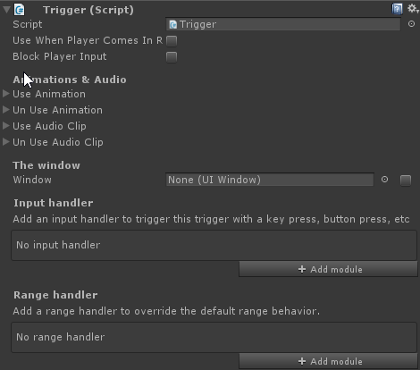

# Triggers

Triggers are objects in the world that can trigger a certain behavior. This can be to open a window, open a door, etc. A simple example of a trigger is a treasure chest. When the player clicks it the treasure chest becomes activated, the user can loot items, and when clicked again the trigger is un-used and the treasure chest closes.



## Input handlers

Input handlers are responsible for handling the input to use / un-use the trigger. This can be by the click of a mouse, tap of a finger, or the press of a (controller) button. The default `TriggerInputHandler` handles all 3 of these use cases.

> Note: To use the trigger key codes your player / character will also need a [trigger selector](TriggerSelector.md).

### ITriggerInputHandler

The `ITriggerInputHandler` interface can be implemented into a custom component to handle the input for the trigger.

> Note that you can also inherit from `TriggerInputHandlerBase`, which contains some helper methods.

```csharp
public class TriggerInputHandler : TriggerInputHandlerBase
{
	public override TriggerActionInfo actionInfo
	{
		get
		{
			return new TriggerActionInfo()
			{
				actionName = triggerKeyCode.ToString()
			};
		}
	}

	[SerializeField]
	private bool _triggerMouseClick = true;
	public virtual bool triggerMouseClick
	{
		get { return _triggerMouseClick; }
	}

	public override bool AreKeysDown()
	{
		if (_triggerKeyCode == KeyCode.None)
		{
			return false;
		}

		return Input.GetKeyDown(_triggerKeyCode);
	}

	public override void OnPointerClick(PointerEventData eventData)
	{
		base.OnPointerClick(eventData);
		if (_triggerMouseClick)
		{
			Use();
		}
	}

	public override string ToString()
	{
		return triggerKeyCode.ToString();
	}
}
```

## Range handlers

A range handler is responsible for defining when the character that intends to use the trigger is in range or not. This can be a simple Vector3.Distance check, a Physics trigger, or something specific for your game type.

### Trigger Range Handler

The default trigger range handler uses Unity's built-in physics system and creates a sphere trigger. This `TriggerRangeHandler` can only be used in combination with the 3D physics system.

### Trigger Range Handler 2D

When you're building a 2D game, and wish to use the built-in range handler, you have to use teh `TriggerRangeHandler2D`; This is because the regular range handler uses a 3D sphere trigger, which is not compatible with 2D physics.

## Trigger callbacks

todo...
