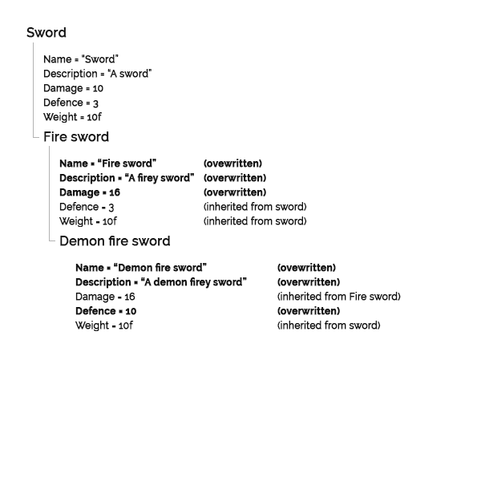

# Items

## Item Registry
The ```ItemRegistry``` is responsible for keeping track of all run-time items.
Keep in mind that if you're going to create a new item instance you'll have to register
it with the item registry. 

> All built-in factories and utility classes will handle the registration for you.

## Item Instance

#### Item instances are run-time items that are based on an [item definition](#item-definition).
Item instances are run-time objects that can be created through code. These items are always
based on an item definition, which is a persistent data structure that contains all
basic information about the item. Because item definitions are persistent their information
should not change at run-time. 

##### Each item instance has a globally unique ID (GUID)
When creating a new item instance you'll have to assign an unique GUID. These GUID's are
used for registry indexing, network transmission / ownership and serialization.
You can create a new System.Guid instance through ```System.Guid.NewGuid();```.

##### Item instances should contain run-time info; Item definition should contain static information.
In the example below we add stats to the item instance.
Because this data is in the item instance the data can manually be set per item instance.

For example:
```csharp
    [System.Serializable]
    public class ItemInstance : IItemInstance, IEquatable<ItemInstance>
    {
        public Guid ID { get; }
        public IItemDefinition itemDefinition { get; }
        public int maxStackSize
        {
            get { return itemDefinition.maxStackSize; } 
        }
        
        // Add stats to the run-time item.
        public Stat[] stats = new Stat[0];
        
        // For (de)serialization...
        private ItemInstance()
        { }
        
        public ItemInstance(Guid ID, IItemDefinition itemDefinition)
        {
            if (itemDefinition == null)
            {
                throw new ArgumentException("Given ItemDefintiion is null!");
            }
            
            this.ID = ID;
            this.itemDefinition = itemDefinition;
        }
        
        // ... Removed for clarity
    }
```

## Item Definition

> Item Definitions only transfer their GUID over the network, therefore,
make sure to persistently store all item defintions if you're using multiplayer.

### Nesting item definitions
Sometimes you may want to create a variation of an existing item. This can be done through
nesting item definitions.

For example:
You have a "Sword" and would now like to create a "Fire Sword". This can be done through nesting item definitions.

> Note: The parent and child item definitions can not differ in type.

- Parent: Sword
- Child Fire Sword
- Child-child: Demon fire sword

In the example below the fireSword inherits all of "Swords" properties, however,
can still handle it's own values.

> When settings the fireSword.property back to the default(T) it will grab
the value from it's parent (sword).
For example:  ```fireSword.damage = 0;``` (where default(int) == 0). The firesword will now
ignore the fireSword.damage property and use its parent property sword.damage instead.

```csharp
// Set some basic stuff
var sword = new ItemDefinition(System.Guid.NewGuid());
sword.name = "Sword";
sword.description = "A sword";
sword.damage = 10;
sword.defence = 3;
sword.weight = 10f;

// Create a fireSword that inherits from sword.
var fireSword = new ItemDefinition(System.Guid.NewGuid(), sword);
fireSword.name = "Fire Sword";
fireSword.description = "A firey sword";
fireSword.damage = 16;
// fireSword.defence == 3 (inherited from sword)
// fireSword.weight == 10f (inherited from sword)

var demonFireSword = new ItemDefinition(System.Guid.NewGuid(), fireSword);
demonFireSword.name = "Demon fire sword";
demonFireSword.description = "A demonly firey sword";
demonFireSword.defence = 10;
// demonFireSword.damage == 16 (inherited from fireSword)
// demonFireSword.weight == 10f (inherited from sword)
```



Resetting values to use the parent value.
```csharp
// Setting the value to default(T) resets it
fireSword.damage = 0;

// fireSword.damage now defaults to sword.damage, because firesword.damage is default(T)
fireSword.damage == sword.damage;
```

### Custom item definition and nesting

When creating a custom item definition you have to make a small adjustment to make it compatible with nesting.
This is very simple and is handled by extension methods.

> Always use the this.GetValue(o => o._property); selector to select your items to enable nesting.

```csharp
    public partial class MyUnityItemDefinition : UnityItemDefinition
    {
        [SerializeField]
        private int _damage;
        public int damage
        {
            get { return this.GetValue(t => t._damage); }
            set { _name = value; }
        }
    }
```

Also see [Creating Custom Items](CustomItem.md)